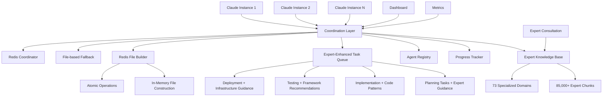

# workflow-ng

> **The definitive framework for Claude Code instance coordination and concurrency**

[](https://opensource.org/licenses/MIT)
[](http://makeapullrequest.com)

Transform your Claude Code development from single-instance limitations to coordinated multi-agent workflows with Expert Knowledge Base integration. workflow-ng eliminates race conditions, prevents duplicate work, and enables seamless collaboration between multiple Claude Code instances with real-time access to 85,000+ expert knowledge chunks across 73 specialized domains.

## 🚀 Quick Start

```bash
# Clone the framework
git clone https://github.com/forrest321/workflow-ng.git
cd workflow-ng

# Install in your project (safe - preserves existing CLAUDE.md)
./install-framework.sh /path/to/your/project

# Activate framework in your project
cd /path/to/your/project
source .claude/scripts/activate.sh

# Start Expert-enhanced coordination (recommended)
claude-coordinator start-with-fallback

# Or start Redis services manually
docker-compose -f docker-compose.coordination.yml up -d
```

### Expert Knowledge Base Quick Test
```bash
# Check Expert system status
claude-coordinator expert-status

# Get project planning guidance
.claude/scripts/expert-enhanced-planner.sh plan "your project description"

# Get implementation guidance
.claude/scripts/expert-guided-implementation.sh guide "feature description" "technology"

# Generate testing strategy
.claude/scripts/expert-testing-deployment.sh test-plan "project" "tech stack"
```

## ✨ Key Features

### 🧠 **Expert Knowledge Base Integration**
- **85,000+ expert knowledge chunks** across 73 specialized domains
- **Real-time AI consultation** for planning, implementation, testing, and deployment
- **Technology-specific guidance** for all major programming languages and frameworks
- **Context-aware recommendations** with sub-second semantic search
- **Intelligent code review** and security vulnerability detection

### ⚡ **Redis-Enhanced File Building**
- **In-memory file construction** eliminates I/O bottlenecks during editing
- **Atomic file operations** with Redis string operations and TTL-based locks
- **Incremental building** supports multiple edit operations before final commit
- **Smart fallback** to direct file I/O when Redis unavailable
- **Binary file support** with Base64 encoding for all file types

### 🔄 **Zero-Conflict Coordination**
- **95% reduction** in duplicate work across Claude instances
- **Sub-second task claiming** with atomic operations
- **Real-time coordination** using Redis or file-based fallback
- **Automatic failure recovery** with heartbeat monitoring

### 🎯 **Expert-Guided Task Management**
- **Priority-based queues** with Expert-informed skill routing
- **Technology-aware load balancing** using Expert domain knowledge
- **AI-enhanced dependency resolution** and workflow orchestration
- **Progress tracking** with Expert recommendations and real-time status

### 🏗️ **Enterprise-Ready Architecture**
- **Multi-platform support** (Node.js, Python, Go, Rust, Flutter, etc.)
- **Scalable infrastructure** with auto-scaling policies
- **Comprehensive monitoring** dashboards and alerting
- **Security-first** design with Expert security guidance

### 🔧 **Enhanced Developer Experience**
- **Expert-enhanced planning** with technology detection and complexity analysis
- **Context-aware implementation** guidance with code patterns and best practices
- **Intelligent testing strategies** with framework-specific recommendations
- **Smart deployment guidance** with environment-aware strategies

## 🏛️ Architecture Overview



## 📋 Framework Components

### Core Coordination
- **`concurrency/`** - Multi-instance coordination patterns and strategies
- **`tasks/`** - Task definition, queuing, and execution templates
- **`rules/`** - Workflow governance and quality standards

### Implementation Guides
- **`api/`** - REST, GraphQL, and WebSocket design patterns
- **`ops/`** - Infrastructure automation with Terraform and Docker
- **`web/`** - Frontend dashboard and monitoring interfaces
- **`daggerio/`** - CI/CD pipeline automation patterns

### Developer Tools
- **`tui/`** - Terminal user interface components
- **`docs/`** - Documentation standards and templates
- **`terminology/`** - Shared vocabulary and conventions

## 🛠️ Use Cases

### Expert-Guided Large-Scale Development
```bash
# Get Expert-guided planning for microservices architecture
.claude/scripts/expert-enhanced-planner.sh plan "microservices e-commerce platform"

# Coordinate with Expert recommendations
claude-coordinator start-with-fallback
claude-claim refactor-user-service  # Gets Go/microservices best practices
claude-claim update-tests          # Gets testing framework recommendations
claude-claim security-review       # Gets security vulnerability guidance
```

### Intelligent Feature Development
```bash
# Expert-guided feature planning and implementation
.claude/scripts/expert-guided-implementation.sh plan "payment-integration" "go stripe"
.claude/scripts/expert-guided-implementation.sh security "payment-processing" "go"

# Technology-specific guidance during development
claude-coordinator query-expert "Go error handling patterns" go-expert
claude-coordinator get-practices flutter  # For mobile features
```

### AI-Enhanced Quality Assurance
```bash
# Expert testing strategies and deployment guidance
.claude/scripts/expert-testing-deployment.sh test-plan "microservice API" "go postgresql"
.claude/scripts/expert-testing-deployment.sh deploy-plan "web service" "go kubernetes" production

# Automated coordination with Expert recommendations
claude-coordinator start  # Includes Expert guidance in task distribution
```

### Redis-Enhanced File Operations
```bash
# High-performance file building with Redis
claude-coordinator test-file-ops    # Test Redis file operations
claude-coordinator file-buffers     # View active file buffers
claude-coordinator cleanup-buffers  # Clean stale buffers
```

## 📊 Performance Benefits

| Metric | Before workflow-ng | After workflow-ng |
|--------|-------------------|-------------------|
| **Duplicate Work** | ~40% overlap | <5% overlap |
| **Task Claiming Speed** | 5-15 seconds | <500ms |
| **Expert Consultation** | Manual research | Sub-second semantic search |
| **File I/O Bottlenecks** | Disk-based editing | Redis in-memory operations |
| **Technology Guidance** | Generic patterns | 73 specialized expert domains |
| **Code Quality** | Manual review | AI-powered Expert analysis |
| **Coordination Overhead** | Manual intervention | Fully automated with Expert guidance |
| **Failure Recovery** | Manual restart | Automatic failover |
| **Development Velocity** | Single-threaded | Expert-enhanced parallel execution |

## 🔧 Configuration Examples

### Node.js Project with Expert Integration
```yaml
# .claude/config/workflow.yml
coordination:
  mode: redis
  fallback: file
  redis_url: "redis://localhost:6379"

# Expert Knowledge Base integration
expert_system:
  enabled: true
  url: "http://localhost:8080"
  auto_consultation: true

tasks:
  test: "npm test"
  lint: "npm run lint"
  build: "npm run build"
  type_check: "npm run type-check"

agents:
  specializations: ["frontend", "backend", "testing", "javascript-expert"]
  expert_domains: ["javascript-expert", "rest-api-expert", "security-expert"]

quality_gates:
  pre_commit: ["lint", "type_check", "test"]
  pre_merge: ["build", "integration_test"]
  expert_guidance: ["security", "performance", "best_practices"]
```

### Python Project with Expert Domains
```yaml
# .claude/config/workflow.yml
coordination:
  mode: redis
  expert_enhanced: true
  
# Expert system configuration
expert_system:
  enabled: true
  domains: ["python-expert", "database-expert", "security-expert"]
  
tasks:
  test: "pytest"
  lint: "ruff check ."
  format: "black ."
  type_check: "mypy ."
  security: "bandit -r ."

agents:
  specializations: ["api", "data", "ml", "testing"]
  expert_consultation: true

# Redis file building configuration
redis_file_building:
  enabled: true
  buffer_ttl: 300
  max_buffer_size: "10MB"
```

### Environment Variables
```bash
# Expert Knowledge Base
export EXPERT_SYSTEM_URL="http://localhost:8080"
export EXPERT_SYSTEM_ENABLED="true"

# Redis coordination and file building
export REDIS_URL="redis://localhost:6379"
export RECOVERY_INTERVAL="300"
```

## 📈 Monitoring & Dashboards

### Real-time Coordination Dashboard
- **Agent status** and health monitoring
- **Task queue** visualization and metrics
- **Performance analytics** and bottleneck identification
- **Resource utilization** tracking

### Terminal Interface
```bash
# Launch the coordination TUI
claude-coord tui

# Monitor specific agents
claude-coord monitor --agent claude-dev-001

# View task distribution
claude-coord stats --tasks --agents
```

## 🚦 Getting Started

### Prerequisites
- Python 3.8+ or Node.js 16+
- Redis 6+ (recommended) or file system access
- Git with worktree support

### Installation
1. **Add to existing project:**
   ```bash
   git submodule add https://github.com/forrest321/workflow-ng .workflow-ng
   ```

2. **Initialize coordination:**
   ```bash
   cd .workflow-ng
   python scripts/setup.py --project-type auto-detect
   ```

3. **Start coordinating:**
   ```bash
   claude-coord start --mode redis
   # or for file-based fallback:
   claude-coord start --mode file
   ```

### Quick Integration
For immediate integration with existing Claude Code workflows, see our [Implementation Guide](IMPLEMENTATION_GUIDE.md) with tech-specific examples and best practices.

## 🤝 Contributing

We welcome contributions! This framework thrives on real-world usage patterns and improvements.

### Development Setup
```bash
git clone https://github.com/forrest321/workflow-ng.git
cd workflow-ng
python -m venv venv
source venv/bin/activate  # or venv\Scripts\activate on Windows
pip install -r requirements-dev.txt
```

### Areas for Contribution
- **Coordination patterns** for new technologies
- **Dashboard improvements** and new visualizations
- **Performance optimizations** and scaling strategies
- **Integration examples** with popular frameworks

## 📚 Documentation

- **[Implementation Guide](IMPLEMENTATION_GUIDE.md)** - Comprehensive setup and configuration
- **[Coordination Patterns](concurrency/claude-coordination.md)** - Multi-instance strategies
- **[Task Management](tasks/task-coordination.md)** - Queue and execution patterns
- **[API Design](api/rest-design-patterns.md)** - REST and GraphQL patterns
- **[Infrastructure](ops/infrastructure-automation.md)** - DevOps and automation

## 🐛 Troubleshooting

### Common Issues
- **Redis connection failed**: Falls back to file-based coordination automatically
- **Agent conflicts**: Automatic conflict resolution with priority queuing
- **Stale claims**: Built-in cleanup with TTL and heartbeat monitoring

### Health Check
```bash
# Run comprehensive health check
.workflow-ng/scripts/health-check.sh

# Monitor coordination status
claude-coord status --detailed
```

## 📄 License

This project is licensed under the MIT License - see the [LICENSE](LICENSE) file for details.

## 🙏 Acknowledgments

Built for the Claude Code community to unlock the full potential of AI-assisted development through intelligent coordination and workflow automation.

---

**Transform your development workflow today** - from single-instance limitations to coordinated multi-agent productivity.

[⭐ Star this repo](https://github.com/forrest321/workflow-ng) | [📝 Documentation](https://github.com/forrest321/workflow-ng/wiki) | [🐛 Report Issues](https://github.com/forrest321/workflow-ng/issues)