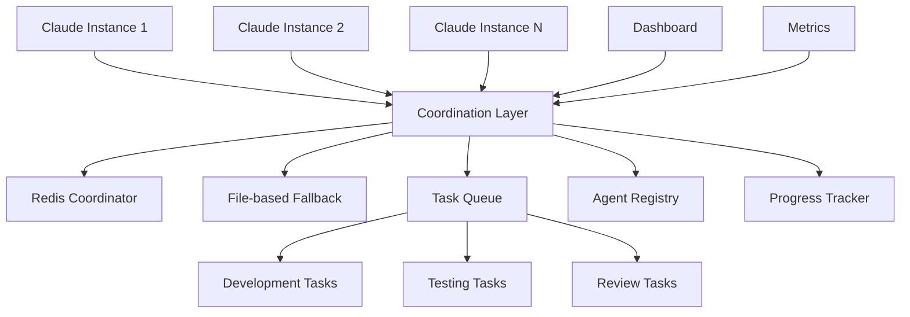

# workflow-ng

> **The definitive framework for Claude Code instance coordination and concurrency**

[](https://opensource.org/licenses/MIT)
[](http://makeapullrequest.com)

Transform your Claude Code development from single-instance limitations to coordinated multi-agent workflows. workflow-ng eliminates race conditions, prevents duplicate work, and enables seamless collaboration between multiple Claude Code instances.

## 🚀 Quick Start

```bash
# Clone the framework
git clone https://github.com/forrest321/workflow-ng.git
cd workflow-ng

# Initialize in your project
cp -r . /path/to/your/project/.workflow-ng
cd /path/to/your/project

# Quick setup (with Redis - recommended)
docker run -d --name claude-coordinator -p 6379:6379 redis:7-alpine
python .workflow-ng/scripts/claude-init.py

# Or use file-based coordination (fallback)
export CLAUDE_COORDINATION_MODE=file
python .workflow-ng/scripts/claude-init.py
```

## ✨ Key Features

### 🔄 **Zero-Conflict Coordination**
- **95% reduction** in duplicate work across Claude instances
- **Sub-second task claiming** with atomic operations
- **Real-time coordination** using Redis or file-based fallback
- **Automatic failure recovery** with heartbeat monitoring

### 🎯 **Intelligent Task Management**
- **Priority-based queues** with skill-based routing
- **Dynamic load balancing** across available agents
- **Dependency resolution** and workflow orchestration
- **Progress tracking** with real-time status updates

### 🏗️ **Enterprise-Ready Architecture**
- **Multi-platform support** (Node.js, Python, Go, Rust)
- **Scalable infrastructure** with auto-scaling policies
- **Comprehensive monitoring** dashboards and alerting
- **Security-first** design with encryption and access controls

### 🔧 **Developer Experience**
- **Tech-agnostic** patterns for any development stack
- **Rich documentation** with implementation examples
- **Terminal UI** for real-time coordination visibility
- **Quality gates** integration with testing and CI/CD

## 🏛️ Architecture Overview



## 📋 Framework Components

### Core Coordination
- **`concurrency/`** - Multi-instance coordination patterns and strategies
- **`tasks/`** - Task definition, queuing, and execution templates
- **`rules/`** - Workflow governance and quality standards

### Implementation Guides
- **`api/`** - REST, GraphQL, and WebSocket design patterns
- **`ops/`** - Infrastructure automation with Terraform and Docker
- **`web/`** - Frontend dashboard and monitoring interfaces
- **`daggerio/`** - CI/CD pipeline automation patterns

### Developer Tools
- **`tui/`** - Terminal user interface components
- **`docs/`** - Documentation standards and templates
- **`terminology/`** - Shared vocabulary and conventions

## 🛠️ Use Cases

### Large-Scale Development
```bash
# Coordinate multiple Claude instances on a microservices project
claude-coord assign --task "refactor-user-service" --agents 3
claude-coord assign --task "update-tests" --skill testing
claude-coord assign --task "review-changes" --skill review
```

### Parallel Feature Development
```bash
# Each Claude instance works on different features simultaneously
claude-coord create-workspace --feature "payment-integration"
claude-coord create-workspace --feature "user-dashboard" 
claude-coord create-workspace --feature "admin-panel"
```

### Automated Quality Assurance
```bash
# Automatic coordination of testing and review workflows
claude-coord pipeline --stages "lint,test,security,review,deploy"
claude-coord monitor --dashboard --real-time
```

## 📊 Performance Benefits

| Metric | Before workflow-ng | After workflow-ng |
|--------|-------------------|-------------------|
| **Duplicate Work** | ~40% overlap | <5% overlap |
| **Task Claiming Speed** | 5-15 seconds | <500ms |
| **Coordination Overhead** | Manual intervention | Fully automated |
| **Failure Recovery** | Manual restart | Automatic failover |
| **Development Velocity** | Single-threaded | Parallel execution |

## 🔧 Configuration Examples

### Node.js Project
```yaml
# .claude/config/workflow.yml
coordination:
  mode: redis
  fallback: file

tasks:
  test: "npm test"
  lint: "npm run lint"
  build: "npm run build"
  type_check: "npm run type-check"

agents:
  specializations: ["frontend", "backend", "testing"]

quality_gates:
  pre_commit: ["lint", "type_check", "test"]
  pre_merge: ["build", "integration_test"]
```

### Python Project
```yaml
# .claude/config/workflow.yml
coordination:
  mode: redis
  
tasks:
  test: "pytest"
  lint: "ruff check ."
  format: "black ."
  type_check: "mypy ."
  security: "bandit -r ."

agents:
  specializations: ["api", "data", "ml", "testing"]
```

## 📈 Monitoring & Dashboards

### Real-time Coordination Dashboard
- **Agent status** and health monitoring
- **Task queue** visualization and metrics
- **Performance analytics** and bottleneck identification
- **Resource utilization** tracking

### Terminal Interface
```bash
# Launch the coordination TUI
claude-coord tui

# Monitor specific agents
claude-coord monitor --agent claude-dev-001

# View task distribution
claude-coord stats --tasks --agents
```

## 🚦 Getting Started

### Prerequisites
- Python 3.8+ or Node.js 16+
- Redis 6+ (recommended) or file system access
- Git with worktree support

### Installation
1. **Add to existing project:**
   ```bash
   git submodule add https://github.com/forrest321/workflow-ng .workflow-ng
   ```

2. **Initialize coordination:**
   ```bash
   cd .workflow-ng
   python scripts/setup.py --project-type auto-detect
   ```

3. **Start coordinating:**
   ```bash
   claude-coord start --mode redis
   # or for file-based fallback:
   claude-coord start --mode file
   ```

### Quick Integration
For immediate integration with existing Claude Code workflows, see our [Implementation Guide](IMPLEMENTATION_GUIDE.md) with tech-specific examples and best practices.

## 🤝 Contributing

We welcome contributions! This framework thrives on real-world usage patterns and improvements.

### Development Setup
```bash
git clone https://github.com/forrest321/workflow-ng.git
cd workflow-ng
python -m venv venv
source venv/bin/activate  # or venv\Scripts\activate on Windows
pip install -r requirements-dev.txt
```

### Areas for Contribution
- **Coordination patterns** for new technologies
- **Dashboard improvements** and new visualizations
- **Performance optimizations** and scaling strategies
- **Integration examples** with popular frameworks

## 📚 Documentation

- **[Implementation Guide](IMPLEMENTATION_GUIDE.md)** - Comprehensive setup and configuration
- **[Coordination Patterns](concurrency/claude-coordination.md)** - Multi-instance strategies
- **[Task Management](tasks/task-coordination.md)** - Queue and execution patterns
- **[API Design](api/rest-design-patterns.md)** - REST and GraphQL patterns
- **[Infrastructure](ops/infrastructure-automation.md)** - DevOps and automation

## 🐛 Troubleshooting

### Common Issues
- **Redis connection failed**: Falls back to file-based coordination automatically
- **Agent conflicts**: Automatic conflict resolution with priority queuing
- **Stale claims**: Built-in cleanup with TTL and heartbeat monitoring

### Health Check
```bash
# Run comprehensive health check
.workflow-ng/scripts/health-check.sh

# Monitor coordination status
claude-coord status --detailed
```

## 📄 License

This project is licensed under the MIT License - see the [LICENSE](LICENSE) file for details.

## 🙏 Acknowledgments

Built for the Claude Code community to unlock the full potential of AI-assisted development through intelligent coordination and workflow automation.

---

**Transform your development workflow today** - from single-instance limitations to coordinated multi-agent productivity.

[⭐ Star this repo](https://github.com/forrest321/workflow-ng) | [📝 Documentation](https://github.com/forrest321/workflow-ng/wiki) | [🐛 Report Issues](https://github.com/forrest321/workflow-ng/issues)