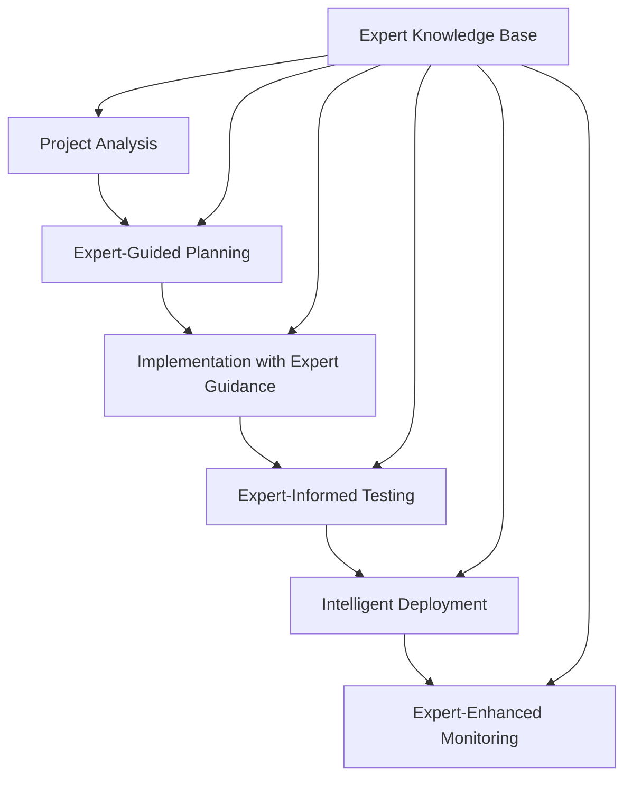

# Expert Knowledge Base Integration Guide

## Overview

The workflow-ng framework has been enhanced with comprehensive Expert Knowledge Base integration, providing AI agents with real-time access to 85,000+ expert knowledge chunks across 73 specialized domains. This integration transforms every phase of the development workflow with intelligent, context-aware guidance.

## System Architecture

### Expert Knowledge Base Components
- **Vector Database**: Milvus standalone with 85,009 indexed chunks
- **Expert Domains**: 73 specialized domains covering programming languages, frameworks, DevOps tools
- **Embeddings**: 768-dimensional vectors using Ollama nomic-embed-text
- **API Layer**: RESTful interface at http://localhost:8080
- **Caching**: BoltDB for embedding cache optimization

### Integration Points
The Expert system is integrated throughout the entire workflow lifecycle:



## Enhanced Workflow Scripts

### 1. Main Coordinator (`workflow-coordinator.sh`)
Enhanced with Expert system health monitoring and query capabilities:

```bash
# Check Expert system status
./scripts/workflow-coordinator.sh expert-status

# Query Expert Knowledge Base directly
./scripts/workflow-coordinator.sh query-expert "Go error handling best practices" go-expert

# Get coordination guidance
./scripts/workflow-coordinator.sh get-guidance deployment docker
```

**New Expert Commands:**
- `query-expert` - Direct Expert Knowledge Base queries
- `get-guidance` - Coordination-specific guidance
- `get-practices` - Technology best practices
- `expert-status` - System health and statistics

### 2. Expert-Enhanced Planner (`expert-enhanced-planner.sh`)
Intelligent project planning with Expert guidance:

```bash
# Detect project technologies
./scripts/expert-enhanced-planner.sh detect

# Analyze project complexity with Expert insights
./scripts/expert-enhanced-planner.sh analyze

# Generate comprehensive project plan
./scripts/expert-enhanced-planner.sh plan "REST API for e-commerce platform"

# Get architecture guidance
./scripts/expert-enhanced-planner.sh architecture "microservice" "go docker kubernetes"
```

**Key Features:**
- Technology stack detection and analysis
- Complexity assessment with Expert recommendations
- Comprehensive planning with domain-specific guidance
- Architecture recommendations from Expert domains

### 3. Expert-Guided Implementation (`expert-guided-implementation.sh`)
Context-aware development assistance:

```bash
# Get implementation guidance
./scripts/expert-guided-implementation.sh guide "authentication system" "go"

# API design guidance
./scripts/expert-guided-implementation.sh api "REST" "javascript"

# Security recommendations
./scripts/expert-guided-implementation.sh security "web application" "node.js"

# Code review with Expert insights
./scripts/expert-guided-implementation.sh review "src/main.go" "security"
```

**Capabilities:**
- Technology-specific implementation patterns
- Security best practices and vulnerability prevention
- Performance optimization guidance
- Expert code review recommendations

### 4. Expert Testing & Deployment (`expert-testing-deployment.sh`)
Intelligent testing and deployment strategies:

```bash
# Generate testing strategy
./scripts/expert-testing-deployment.sh test-strategy "microservice" "go redis"

# Get CI/CD guidance
./scripts/expert-testing-deployment.sh cicd "python flask" github

# Deployment strategy recommendations
./scripts/expert-testing-deployment.sh deploy-strategy production "go kubernetes"

# Comprehensive test plan
./scripts/expert-testing-deployment.sh test-plan "REST API" "go postgresql"
```

**Features:**
- Framework-specific testing recommendations
- CI/CD pipeline optimization
- Environment-aware deployment strategies
- Monitoring and observability guidance

## Expert Domain Coverage

### High Priority Domains
- **fibrebeam**: Go Fiber backend development
- **flutterbeam**: Flutter mobile/desktop development
- **crypto**: Blockchain and cryptocurrency
- **ethereum-expert**: Ethereum ecosystem development

### Programming Languages (13 domains)
JavaScript, TypeScript, Go, Rust, Java, Ruby, PHP, Swift, Kotlin, Scala, Haskell, Elixir, Lua

### Infrastructure & DevOps (7 domains)
Docker, Kubernetes, Terraform, Ansible, Linux, Ubuntu, Deployment

### Web Development (7 domains)
HTML5, REST API, GraphQL, PWA, Rails, Spring Boot, HTTP

### Database Systems (5 domains)
General database design, MySQL, PostgreSQL, SQL, Firebase

### Development Tools (9 domains)
Git, GitHub API, CLI tools, Security, Bots, Code review, Project management

## Usage Patterns

### 1. Project Initialization
```bash
# Detect and analyze project
./scripts/expert-enhanced-planner.sh detect
./scripts/expert-enhanced-planner.sh analyze

# Generate expert-guided plan
./scripts/expert-enhanced-planner.sh plan "Your project description"
```

### 2. Implementation Phase
```bash
# Get implementation guidance
./scripts/expert-guided-implementation.sh guide "feature description" "technology"

# Security consultation
./scripts/expert-guided-implementation.sh security "context" "technology"

# Performance optimization
./scripts/expert-guided-implementation.sh performance "context" "technology"
```

### 3. Testing Phase
```bash
# Detect existing testing setup
./scripts/expert-testing-deployment.sh detect-testing

# Generate comprehensive testing plan
./scripts/expert-testing-deployment.sh test-plan "project description" "tech stack"
```

### 4. Deployment Phase
```bash
# Detect deployment tools
./scripts/expert-testing-deployment.sh detect-deploy

# Generate deployment plan
./scripts/expert-testing-deployment.sh deploy-plan "project" "tech stack" "environment"
```

## Configuration

### Environment Variables
```bash
# Expert Knowledge Base URL
export EXPERT_SYSTEM_URL="http://localhost:8080"

# Enable/disable Expert integration
export EXPERT_SYSTEM_ENABLED="true"

# Include in workflow coordination
export REDIS_URL="redis://localhost:6379"
export RECOVERY_INTERVAL="300"
```

### Connection Protocol
Always check for existing Expert system server before starting new instance:

```bash
# Test connection
curl -s "http://localhost:8080/health"

# Check system stats
curl -s "http://localhost:8080/api/v1/index/stats" | jq .

# Only start if connection fails
cd /Users/fo/Documents/code/experts/vector-knowledge-base
./bin/server &
```

## Integration Benefits

### 1. Intelligent Planning
- Technology stack validation with Expert domain knowledge
- Complexity assessment with domain-specific insights
- Architecture recommendations from specialized experts
- Risk assessment with security and performance considerations

### 2. Context-Aware Implementation
- Language-specific best practices and patterns
- Framework-optimized implementation strategies
- Security vulnerability prevention
- Performance optimization techniques

### 3. Expert Testing Strategies
- Framework-specific testing recommendations
- Test automation guidance
- Coverage and quality metrics
- CI/CD integration best practices

### 4. Intelligent Deployment
- Environment-specific deployment strategies
- Infrastructure optimization recommendations
- Monitoring and observability setup
- Rollback and recovery planning

## Troubleshooting

### Expert System Unavailable
The system gracefully degrades when Expert Knowledge Base is unavailable:
- Scripts continue with standard recommendations
- Warning messages indicate Expert guidance is unavailable
- Fallback to general best practices

### Performance Optimization
- Use appropriate `top_k` values (5-20 typically sufficient)
- Cache frequently used results when possible
- Monitor system performance via monitoring dashboard

### Query Optimization
- Use specific, technical queries for better results
- Include technology names and specific concepts
- Combine related terms for comprehensive results
- Use domain filtering for targeted guidance

## Best Practices

### 1. Query Formulation
- Be specific about technology stack and context
- Include relevant domain terms
- Specify the type of guidance needed (implementation, testing, deployment)

### 2. Result Processing
- Parse JSON responses to extract relevant content
- Check relevance scores (higher = more relevant)
- Combine multiple Expert responses for comprehensive guidance

### 3. Workflow Integration
- Start each phase with Expert consultation
- Use Expert guidance to inform task breakdown
- Cache Expert recommendations for reuse
- Document Expert-guided decisions

## Future Enhancements

### Planned Features
- Real-time code analysis with Expert recommendations
- Automated Expert consultation triggers
- Integration with development IDEs
- Expert-guided code generation
- Advanced workflow optimization based on Expert insights

### Extensibility
The Expert system integration is designed for extensibility:
- Additional expert domains can be added
- Custom query endpoints can be implemented
- Workflow scripts can be enhanced with new Expert capabilities
- Integration patterns can be applied to other tools and systems

---

**System Status**: 🟢 OPERATIONAL with 85,009 chunks indexed across 73 expert domains
**Integration Level**: Full workflow lifecycle coverage
**Performance**: Sub-second semantic search response times